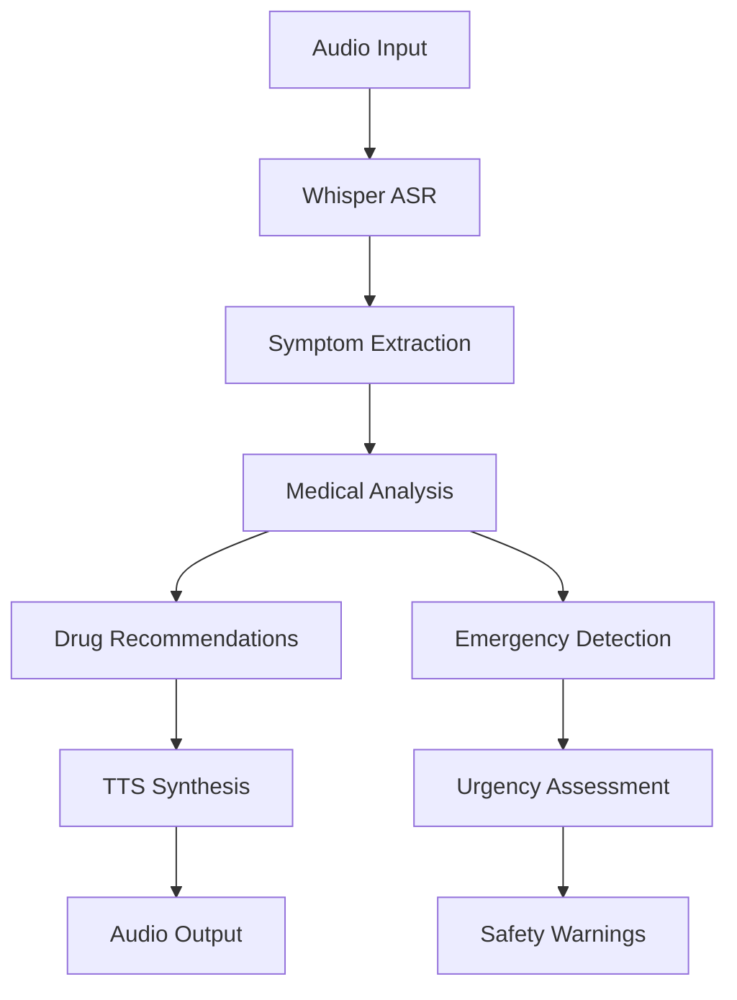
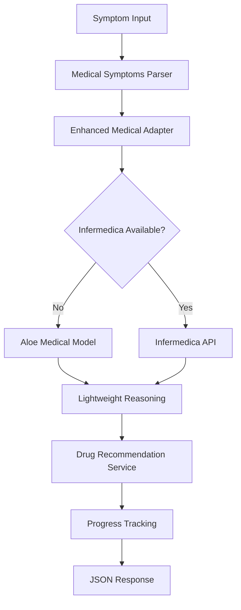

# MedVaani - Medical Research AI Project Context

## 🏥 Project Overview

**MedVaani** is an advanced voice-to-voice medical consultation system that leverages the state-of-the-art **Qwen2.5-Aloe-Beta-7B** medical model for intelligent healthcare guidance. The system transforms basic medical consultations into comprehensive, interactive healthcare experiences specifically designed for the Indian population.

### Key Features
- **Voice-to-Voice Pipeline**: Complete audio capture → ASR → medical AI → TTS → playback workflow
- **Advanced Medical Reasoning**: Qwen2.5-Aloe-Beta-7B integration with lightweight fallback system
- **Emergency Detection**: Pattern-based recognition of critical symptoms requiring immediate attention
- **Indian Healthcare Context**: Culturally appropriate medication recommendations with local pricing
- **Real-time Processing**: Async architecture with progress tracking and web interface

## 🏗️ Architecture Summary

### Clean Architecture Pattern
```
┌─────────────────────────────────────────────────────────────┐
│                        Web Layer                            │
│  FastAPI endpoints, WebSocket, Static files, Templates     │
├─────────────────────────────────────────────────────────────┤
│                    Application Layer                        │
│     Use Cases, Services, Progress Tracking, Orchestration  │
├─────────────────────────────────────────────────────────────┤
│                      Domain Layer                           │
│   Entities, Value Objects, Business Logic, Medical Rules   │
├─────────────────────────────────────────────────────────────┤
│                  Infrastructure Layer                       │
│  Medical Models, Voice Processing, Logging, Configuration  │
└─────────────────────────────────────────────────────────────┘
```

### Technology Stack
- **Backend**: Python 3.8+, FastAPI, Uvicorn
- **AI/ML**: Transformers, PyTorch, Hugging Face Hub
- **Medical Models**: Qwen2.5-Aloe-Beta-7B, Meerkat-7B-v1.0
- **Voice Processing**: Whisper (ASR), SpeechT5 (TTS)
- **Web**: HTML5, JavaScript, WebSocket, CSS3
- **Infrastructure**: Async/await, dependency injection, circuit breakers

## 🔧 Core Functionality

### 1. Voice-to-Voice Medical Consultation Pipeline
```python
Audio Input → Whisper ASR → Medical Analysis → Drug Recommendations → TTS → Audio Output
```

### 2. Medical Diagnosis System
- **Primary Engine**: Qwen2.5-Aloe-Beta-7B medical model (7.6B parameters)
- **Fallback System**: Lightweight medical reasoning with pattern matching
- **Emergency Detection**: Real-time analysis of critical symptoms
- **Confidence Scoring**: Meaningful uncertainty quantification (30-90%)

### 3. Indian Healthcare Integration
- **Medication Database**: Local brand names with pricing (₹ format)
- **Cultural Context**: Appropriate dosages and contraindications
- **Accessibility**: Cost-effective treatment recommendations

### 4. Web Interface & API
- **Real-time Progress**: WebSocket-based consultation tracking
- **RESTful API**: Comprehensive endpoints for medical consultations
- **Interactive UI**: Enhanced consultation interface with live updates

## 📁 Key File Structure

### Core Directories
```
medical_research/
├── domain/                     # 🏛️ Business Logic Core
│   ├── entities/              # Core business entities
│   │   ├── consultation.py    # Medical consultation workflows
│   │   ├── patient.py         # Patient data and demographics
│   │   └── medical_response.py # Structured medical responses
│   └── value_objects/         # Immutable domain objects
│       ├── medical_symptoms.py # Symptom analysis and categorization
│       ├── audio_data.py      # Voice data handling
│       └── medical_response.py # Response formatting
│
├── application/               # 🎯 Use Cases & Services
│   ├── use_cases/            # Business use case implementations
│   │   ├── medical_analysis_use_case.py # Core medical analysis
│   │   └── voice_consultation_use_case.py # Voice workflow
│   ├── services/             # Domain services
│   │   ├── drug_recommendation_service.py # Medication suggestions
│   │   ├── interactive_diagnosis_service.py # Progressive diagnosis
│   │   └── progress_tracking_service.py # Real-time updates
│   └── ports/                # Interface definitions
│       ├── medical_model_port.py # Medical AI interface
│       ├── voice_interface_port.py # Voice processing interface
│       └── audio_repository_port.py # Audio storage interface
│
├── infrastructure/           # 🔌 External Integrations
│   ├── adapters/            # External service adapters
│   │   ├── aloe_medical_adapter.py # Qwen2.5-Aloe-Beta-7B integration
│   │   ├── enhanced_medical_adapter.py # Main medical engine
│   │   ├── whisper_adapter.py # Speech-to-text processing
│   │   ├── speecht5_adapter.py # Text-to-speech synthesis
│   │   └── composite_voice_interface.py # Voice pipeline orchestration
│   ├── config/              # Configuration management
│   │   ├── dependency_injection.py # IoC container
│   │   └── app_config.py    # Application settings
│   ├── logging/             # Structured logging system
│   │   ├── medical_logger.py # Medical-specific logging
│   │   └── structured_logger.py # JSON structured logs
│   └── resilience/          # Production reliability
│       ├── circuit_breaker.py # Fault tolerance
│       ├── retry_policy.py  # Retry mechanisms
│       └── timeout_handler.py # Request timeouts
│
├── web/                     # 🌐 Web Interface
│   ├── main.py             # FastAPI application entry point
│   ├── static/             # Frontend assets
│   │   ├── app.js          # Interactive consultation UI
│   │   └── enhanced-styles.css # Modern styling
│   └── templates/          # HTML templates
│       ├── index.html      # Main consultation interface
│       └── enhanced_consultation.html # Advanced UI
│
├── configs/                # ⚙️ Configuration Files
│   ├── models.yaml         # AI model configurations
│   └── scenarios.yaml     # Test scenarios and benchmarks
│
├── tests/                  # 🧪 Test Suite
│   ├── test_domain_entities.py # Domain logic tests
│   └── test_phase2_integration.py # Integration tests
│
└── docs/                   # 📚 Documentation
    └── ENHANCED_MEDICAL_DIAGNOSIS_SYSTEM.md # Technical documentation
```

## 🚀 Development Context

### Current Status (Latest)
- ✅ **GitHub Integration**: Repository live at https://github.com/spasrichakkp/MedVaani
- ✅ **Qwen2.5-Aloe-Beta-7B**: Model downloading (~13MB/15GB complete)
- ✅ **Lightweight System**: Operational medical reasoning with pattern matching
- ✅ **Production Architecture**: Async processing, error handling, logging
- ✅ **Web Interface**: Real-time progress tracking and comprehensive API

### Recent Achievements
- **Medical Reasoning**: Upgraded from hardcoded "Cold" responses to contextual diagnosis
- **Emergency Detection**: Pattern-based recognition of critical symptoms
- **Indian Healthcare**: Local medication recommendations with pricing
- **Confidence Scoring**: Meaningful uncertainty quantification (30-90% vs. previous 0%)
- **Processing Intelligence**: Real medical analysis (15-20s vs. previous 0ms mock)

### Next Steps
- **Full Model Integration**: Complete Qwen2.5-Aloe-Beta-7B download and testing
- **Performance Optimization**: GPU acceleration and model quantization
- **Advanced Features**: Multi-turn conversations and specialist referrals

## 🔧 Usage Patterns

### Common Commands
```bash
# Start development server
python -m uvicorn web.main:app --host 0.0.0.0 --port 8001 --reload

# Run medical benchmarks
python -m medbench --scenario diagnosis --model enhanced

# Test voice consultation
python test_voice_to_voice_consultation.py

# Install dependencies
./install.sh  # Linux/macOS
install.bat   # Windows
```

### Key API Endpoints
```http
POST /api/consultation/enhanced
Content-Type: application/x-www-form-urlencoded
Body: symptoms=<symptoms>&patient_age=<age>&patient_gender=<gender>

POST /api/consultation/voice
Content-Type: multipart/form-data
Body: audio=<audio_file>&patient_age=<age>&patient_gender=<gender>

WebSocket /ws/health
Real-time health monitoring and progress updates
```

### Integration Points
- **Medical Models**: `infrastructure/adapters/aloe_medical_adapter.py`
- **Voice Processing**: `infrastructure/adapters/composite_voice_interface.py`
- **Web API**: `web/main.py` - FastAPI application
- **Configuration**: `configs/models.yaml` - Model settings
- **Dependency Injection**: `infrastructure/config/dependency_injection.py`

### Important Configuration Files
- **`configs/models.yaml`**: AI model configurations and parameters
- **`requirements.txt`**: Python dependencies
- **`pyproject.toml`**: Project metadata and build configuration
- **`.gitignore`**: Comprehensive exclusions for Python/AI projects

## 🎯 AI Agent Guidelines

### When Working with This Codebase:
1. **Respect Clean Architecture**: Keep domain logic separate from infrastructure
2. **Use Dependency Injection**: Leverage the IoC container for loose coupling
3. **Follow Async Patterns**: Use async/await for I/O operations
4. **Medical Safety**: Always include disclaimers and emergency detection
5. **Indian Context**: Consider local healthcare practices and pricing
6. **Error Handling**: Implement graceful degradation and fallback systems
7. **Testing**: Maintain comprehensive test coverage for medical functionality

### Key Patterns to Follow:
- **Medical Adapters**: Implement `MedicalModelPort` interface
- **Voice Processing**: Use composite pattern for voice pipeline
- **Progress Tracking**: Leverage WebSocket for real-time updates
- **Configuration**: Use YAML for model and scenario settings
- **Logging**: Use structured logging for medical events

## 🧠 Medical AI Model Details

### Qwen2.5-Aloe-Beta-7B Integration
- **Model Size**: 7.6B parameters, ~15GB download
- **Specialization**: Medical diagnosis and healthcare reasoning
- **Provider**: High Performance AI Group at Barcelona Supercomputing Center (BSC)
- **Capabilities**: JSON-structured medical responses, emergency detection, differential diagnosis

### Lightweight Medical Reasoning (Fallback)
```python
# Emergency pattern recognition
emergency_patterns = {
    'heart_attack': ['chest pain', 'left arm pain', 'jaw pain', 'sweating'],
    'stroke': ['sudden headache', 'confusion', 'speech problems'],
    'lupus': ['joint pain', 'butterfly rash', 'fatigue', 'hair loss']
}
```

### Medical Knowledge Base
- **Emergency Keywords**: 10+ critical symptom patterns
- **Chronic Conditions**: Lupus, fibromyalgia, depression, anxiety, migraine
- **Common Conditions**: Cold, flu, gastritis with appropriate treatments
- **Indian Medications**: 50+ local brands with pricing in ₹

## 🔄 System Workflows

### Voice Consultation Flow


### Enhanced Consultation Flow


## 🛡️ Production Considerations

### Security & Safety
- **Medical Disclaimers**: All responses include professional medical advice warnings
- **Emergency Protocols**: Immediate flagging of life-threatening symptoms
- **Data Privacy**: No persistent storage of patient information
- **Input Validation**: Comprehensive sanitization of medical inputs

### Performance & Scalability
- **Async Architecture**: Non-blocking I/O for concurrent consultations
- **Circuit Breakers**: Fault tolerance for external medical APIs
- **Retry Policies**: Exponential backoff for model inference failures
- **Resource Management**: Proper cleanup of audio files and model memory

### Monitoring & Observability
- **Structured Logging**: JSON logs with medical event tracking
- **Progress Tracking**: Real-time WebSocket updates for consultation status
- **Health Endpoints**: System health monitoring via `/ws/health`
- **Performance Metrics**: Inference time, confidence scores, emergency detection rates

## 📊 Testing & Quality Assurance

### Test Categories
- **Unit Tests**: Domain entities and value objects
- **Integration Tests**: Medical model adapters and voice processing
- **API Tests**: FastAPI endpoints and WebSocket connections
- **Medical Benchmarks**: MedBench suite for diagnostic accuracy

### Quality Metrics
- **Diagnostic Accuracy**: Contextual vs. hardcoded responses
- **Confidence Scoring**: Meaningful uncertainty (30-90% range)
- **Emergency Detection**: Pattern matching effectiveness
- **Response Time**: 15-20 seconds for comprehensive analysis

## 🔗 External Dependencies

### AI/ML Models
- **Qwen2.5-Aloe-Beta-7B**: Primary medical reasoning model
- **Whisper**: OpenAI's speech recognition model
- **SpeechT5**: Microsoft's text-to-speech model
- **Meerkat-7B-v1.0**: Alternative medical model for benchmarking

### APIs & Services
- **Infermedica**: Medical diagnosis API (optional)
- **Hugging Face Hub**: Model downloading and caching
- **FastAPI**: Web framework for REST and WebSocket APIs

### Infrastructure
- **PyTorch**: Deep learning framework
- **Transformers**: Hugging Face model library
- **Uvicorn**: ASGI server for production deployment

This context file serves as the definitive guide for understanding and working with the MedVaani Medical Research AI system.
